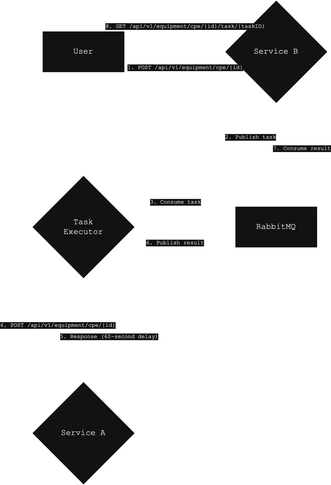

## Equipment Activation

### Components

- **Service A**
  - Endpoint: `POST /api/v1/equipment/cpe/{id}`
  - Simulates a 60-second processing delay and returns a success response.

- **Service B**
  - Endpoint: `POST /api/v1/equipment/cpe/{id}`
  - Returns a unique task ID
  - Checks task status at `GET /api/v1/equipment/cpe/{id}/task/{task}`
  - Uses RabbitMQ to publish tasks and consume results

- **Task Executor**
  - Listens on queue `equipment_tasks`
  - Calls Service A to process the configuration
  - Publishes the result to the queue `equipment_results`

### Prerequisites

- Python (2.7)
- Docker
- Docker Compose
- Ansible

### Installation

#### Docker

1. Build and start the services:

    ```shell
    docker-compose up --detach --build
    ```

2. Access service endpoints:
   - Service A: `https://localhost:5001`
   - Service B: `https://localhost:5002`

#### Ansible

1. Edit the `ansible/inventory.ini` file if necessary
2. Run the playbook:

    ```shell
    ansible-playbook -i ansible/inventory.ini ansible/playbook.yml
    ```

### Tests

1. Install `futures` and `requests==2.27.1` libraries
2. Run the tests:

    ```shell
    python integration_tests/test_services.py
    ```

### Communication Diagram

